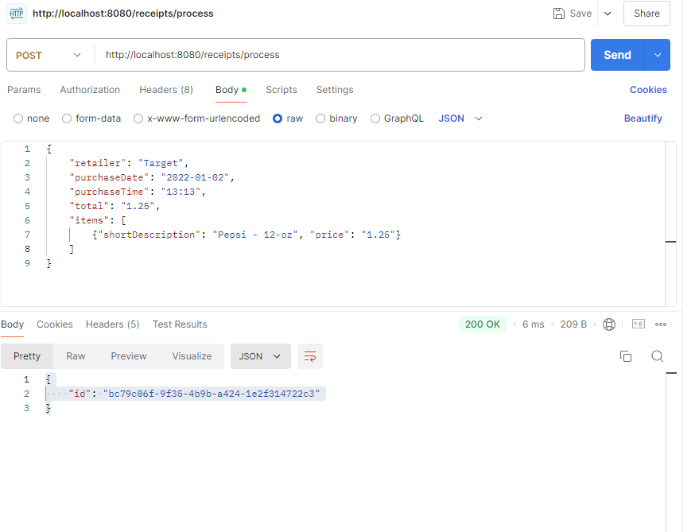
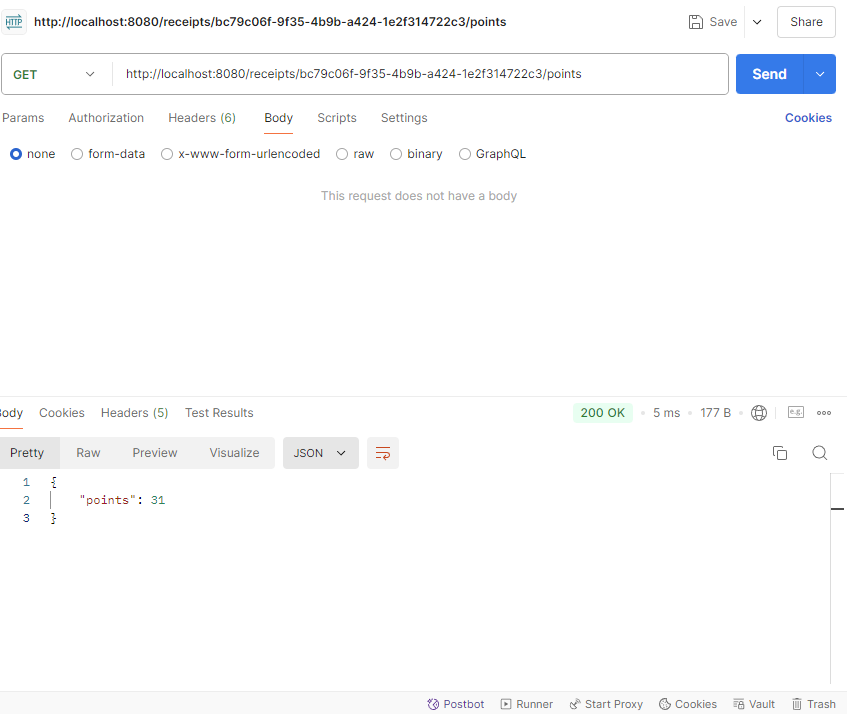

# Receipt Processor Challenge

This repository contains Java based solution to the Receipt Processor Challenge  provided by Fetch Rewards. This is developed using spring boot framework and primarily consists of 2 rest endpoints processing receipts and returns response with number of points based on certain conditions.

1. The /receipts/process POST endpoint accepts aa JSON Object with receipt details. It internally calculates the point based on the details in JSON object and returns unique UUD
2. The /receipts/{id}/points GET endpoint returns the number of points based on the unique UUID provided in path variable.

## Prerequisites
- Docker Installation
- Postman to test Api or any other rest api testing tool

## Steps to run Spring boot based java application using Docker

1. Clone the directory
2. CD into the cloned repo directory
2. Launch the Docker client or the Docker desktop application
3. Build the image

        docker build --platform linux/amd64 -t spring-receipt-processor-challenger .

4. Run the spring boot backend application

        docker run -p 8080:8080 -t spring-receipt-processor-challenger

5. The server will start on `http://localhost:8080`

## Testing the Application after the application starts running in docker

1. Using Postman
    1. Process a receipt
        1. Open a workspace in Postman
        2. Select the request type as "POST"
        3. Put the URL as `http://localhost:8080/receipts/process`
        4. Click on "Body"
        5. Clik on "raw"
        6. Select "JSON" from the dropdown
        7. Paste this in the text field
           {
           "retailer": "Target",
           "purchaseDate": "2022-01-02",
           "purchaseTime": "13:13",
           "total": "1.25",
           "items": [
           {"shortDescription": "Pepsi - 12-oz", "price": "1.25"}
           ]
           }
        8. Hit "Send"
        9. Example Response:
           {
           "id": "bc79c06f-9f35-4b9b-a424-1e2f314722c3"
           }

    2. Get receipt points
        1. Add a tab for another request in the postman workspace
        2. Select the request type as "GET"
        3. Put the URL as `http://localhost:8080/receipts/926314cb-e6e2-442e-954c-eb461907210b/points`
        4. Hit "Send"
        5. Example Response:
           {
           "points": 31
           }

